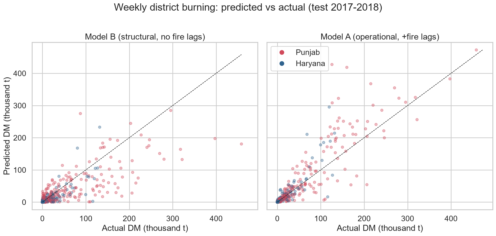
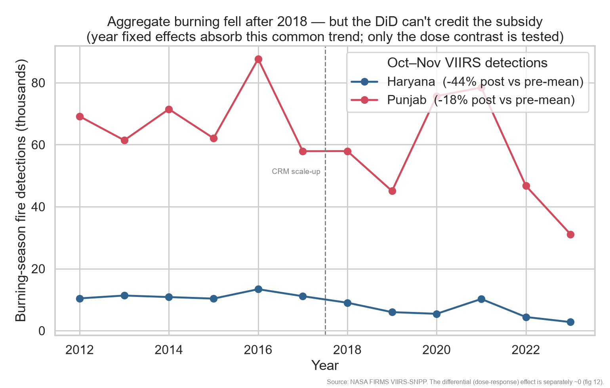

# 🔥 Stubble Fires vs. the Crop-Residue Subsidy

[](https://stubble-fires-crm.streamlit.app/) &nbsp;**→ [stubble-fires-crm.streamlit.app](https://stubble-fires-crm.streamlit.app/)**

**Can we predict where farm fires will spike next season, and did India's crop-residue
equipment subsidy actually put them out in Punjab and Haryana?**

Every October and November, farmers across Punjab and Haryana burn paddy stubble to clear
their fields for wheat. The smoke is a big part of why Delhi's air turns hazardous each
winter. From 2018-19 the government scaled up the Crop-Residue-Management (CRM) scheme,
which subsidises machines — the Happy Seeder, Super Seeder, balers — that let farmers sow
without burning first.

I set out to answer two questions from raw data, end to end:

1. **Where next?** A district-by-week early-warning model for the hotspots. It reaches
   R² = 0.90, Spearman = 0.96 and ROC-AUC = 0.99 on a held-out 2017–18 test.
2. **Did the subsidy work?** A dose-response difference-in-differences on the CRM rollout.
   The answer is a null: β = +0.04 (p = 0.58). Burning did fall overall, but not in
   proportion to how many machines a district actually received.

The full write-up, with every figure and the robustness tables, is in
[`reports/FINDINGS.md`](reports/FINDINGS.md).

## Results at a glance

| Q1 — Can we see the hotspots coming? | Q2 — Did the subsidy reduce burning? |
|:---:|:---:|
| [](reports/figures/05_pred_vs_actual.png) | [](reports/figures/13_aggregate_trend.png) |
| The week-ahead model tracks the held-out 2017–18 seasons closely (R² = 0.90, ROC-AUC = 0.99). | Burning fell after 2018 (Haryana −44%, Punjab −18%), but the DiD is a null (β = +0.04, p = 0.58): higher-dose districts didn't fall any faster, so the design can't credit the subsidy. |

## What I found

- **The fires are very predictable, just not from the weather.** Last week's burning, the
  crop calendar, and which district it is together carry about 97% of the model's signal.
  An eight-variable ERA5 weather block moves R² by +0.004, and it actually hurts a model
  with no persistence term by 0.09. Weather decides whether burning is *possible*, not
  where it concentrates.
- **The money went to the districts already burning the most.** Within-state rank
  correlation between machines and prior burning is +0.86 in Punjab and +0.69 in Haryana
  (+0.88 / +0.83 on the FIRMS data). That's reasonable as policy but a hard confound for
  the analysis: even a within-district DiD can't fully clean it. The pre-trends look
  parallel when I pool the two states, yet they fail inside Punjab (joint p = 0.005), which
  is exactly where the dose actually varies.
- **There's no sign the subsidy drove the decline.** On a consistent NASA FIRMS outcome
  spanning 2012–2023, the dose-response DiD comes back at β = +0.04 (p = 0.58), and every
  robustness check I ran lands somewhere between zero and positive. Total Oct–Nov burning
  did drop after 2018 (Haryana −44%, Punjab −18%), but a design with year fixed effects
  can't credit the subsidy for a trend common to everyone, and the differential test — did
  the more-subsidised districts fall further? — comes back empty. The fair reading is "no
  detectable dose-response effect, and this quasi-experiment can't cleanly isolate one."

## Why it's built this way

- It runs on raw satellite grids and primary government records, not a tidy analysis CSV.
  Fire mass comes from the SAGE-IGP 0.25° daily inventory; the treatment data I pulled by
  hand from PPCB MIS and Haryana CRM action-plan PDFs.
- It's a real policy-evaluation question, and I diagnose the identification problem (the
  targeting) out in the open instead of hiding it.
- And it connects to something millions of people live through every winter: Delhi's smog.

## Data sources

| Layer | Source | Coverage | Access |
|---|---|---|---|
| Fire (burned dry matter) | SAGE-IGP (Liu et al. 2020, Harvard Dataverse, CC0) | 2003–2018, 0.25° daily | keyless |
| Weather | Open-Meteo ERA5 archive | 2012–2018, daily→weekly | keyless |
| Treatment (CRM machines) | PPCB MIS (Punjab, actual) + Haryana CRM plan (targets) | 2018–2022, district | primary PDFs/portal |
| Geography | geoBoundaries ADM2 (CC-BY) | 43 districts | keyless |
| Fire — active-fire counts *(causal outcome)* | NASA FIRMS VIIRS-SNPP archive | 2012–2023, 375 m → district×year | free `MAP_KEY` (emailed) |

## Repository layout

```
src/fire_policy/
  config.py      # geography, time windows, paths, FIRMS templates
  geo.py         # geoBoundaries → Punjab/Haryana district layer, point tagging, centroids
  sage.py        # SAGE-IGP grids → district×year and district×week burned-mass panels
  weather.py     # Open-Meteo ERA5 → district×week weather (multi-location batched)
  treatment.py   # PPCB + Haryana CRM records → harmonised district dose panel
  predict.py     # district×week LightGBM early-warning model + weather ablation
  causal.py      # dose-response DiD: targeting, parallel-trends, placebos, estimator
  effect.py      # DiD finisher: consistent FIRMS 2012–23 outcome → β + event study + aggregate trend
  eda.py         # descriptive figures + interactive hotspot map
  firms.py       # NASA FIRMS fetchers (VIIRS-SNPP archive → causal outcome)
  panel.py       # standardized FIRMS points → balanced district×period fire panel
app/
  streamlit_app.py  # interactive dashboard: early-warning hotspots + causal design
data/            # raw / interim / processed   (raw is gitignored, re-fetchable)
reports/         # FINDINGS.md + figures/ (01–13) + hotspot_map.html
notebooks/       # 01_data → 02_eda → 03_prediction → 04_causal (narrative walk-throughs)
```

## Notebooks

Four notebooks walk through the project from the raw data to the causal effect. They're
thin wrappers over the package: each one loads the processed panels, calls the same
analysis functions, and embeds the figures. I commit them already run, so the tables and
plots show up on GitHub without needing a kernel.

| Notebook | What it covers |
|---|---|
| [`01_data`](notebooks/01_data.ipynb) | The three panels, the harmonised CRM dose, the 2018 wall |
| [`02_eda`](notebooks/02_eda.ipynb) | Concentration of burning, timing, the weak fire–weather link |
| [`03_prediction`](notebooks/03_prediction.ipynb) | Week-ahead model, climatology baseline, weather ablation |
| [`04_causal`](notebooks/04_causal.ipynb) | Dose-response DiD: targeting, parallel trends, placebos, the FIRMS effect |

Rebuild them from source with `PYTHONPATH=src .venv/Scripts/python notebooks/_build_notebooks.py`.

## Getting started

```bash
python -m venv .venv
.venv/Scripts/python -m pip install -r requirements.txt
```

Run the pipeline in order. Each stage writes to `data/processed/` and can be re-run on its
own:

```bash
PYTHONPATH=src .venv/Scripts/python -m fire_policy.geo        # district layer
PYTHONPATH=src .venv/Scripts/python -m fire_policy.sage       # fire panels
PYTHONPATH=src .venv/Scripts/python -m fire_policy.weather    # ERA5 weekly weather
PYTHONPATH=src .venv/Scripts/python -m fire_policy.treatment  # CRM dose panel
PYTHONPATH=src .venv/Scripts/python -m fire_policy.eda        # figures 01–04
PYTHONPATH=src .venv/Scripts/python -m fire_policy.predict    # figures 05–08 + ablation
PYTHONPATH=src .venv/Scripts/python -m fire_policy.causal     # figures 09–11 + DiD checks
```

**Reproducing the causal effect.** The first run needs a free NASA FIRMS `MAP_KEY` (emailed
when you sign up at <https://firms.modaps.eosdis.nasa.gov/api/area/>), which goes in `.env`
as `FIRMS_MAP_KEY=...`. It caches the FIRMS panel, so every run after the first rebuilds the
DiD offline:

```bash
PYTHONPATH=src .venv/Scripts/python -m fire_policy.effect     # β + event study + aggregate (figs 12–13)
```

**Exploring it interactively.** Try the [live dashboard](https://stubble-fires-crm.streamlit.app/),
or run it locally (it reads the processed panels and figures):

```bash
PYTHONPATH=src .venv/Scripts/python -m streamlit run app/streamlit_app.py
```

## Status

- [x] **Data** — SAGE-IGP fire panels (301 district-years, 2,838 district-weeks); ERA5
  weekly weather (4,171 district-weeks); harmonised CRM treatment (43 districts).
- [x] **Geo & EDA** — district layer, area-weighted fire allocation, hotspot map, timing.
- [x] **Prediction** — district×week model, climatology baseline, weather ablation,
  early-warning evaluation (figs 05–08).
- [x] **Causal (design + pre-period)** — treatment doses, targeting analysis,
  parallel-trends event study, placebo DiDs (figs 09–11).
- [x] **Causal (effect)** — consistent NASA FIRMS VIIRS outcome, 2012–2023 (516
  district-years); dose-response DiD β = +0.04 (p = 0.58), robustness table, dynamic
  event study, aggregate trend (figs 12–13). Result: no dose-response reduction.
- [x] **Notebooks** — four executed, figure-embedded walk-throughs (01_data → 04_causal).
- [x] **Dashboard** — Streamlit app: interactive early-warning hotspots + causal-design
  walk-through (`app/streamlit_app.py`).

## Caveats

- **The result is a null, and a confounded one.** The dose-response DiD finds no reduction
  (β = +0.04, p = 0.58), but near-perfect targeting (ρ ≈ 0.88) and a Punjab pre-trend that
  fails (p = 0.005) mean I can't read it as a clean causal zero — only as "no evidence that
  machines-per-district cut burning." With year fixed effects the design is also blind to a
  uniform, state-wide effect of the scheme.
- **The two states aren't measured the same way.** Punjab reports actual cumulative
  machines; Haryana reports one-year targets that are near-uniform across districts. I
  harmonise both to a within-state z-score, but the real dose variation is Punjab's.
- **The fire grid is coarse.** SAGE-IGP is 0.25° (~667 km²), so district totals are
  approximate and area-weighted, which smooths the smaller districts.
- **Weather barely helps the prediction**, and that's a finding rather than a bug: the
  decision to burn tracks the harvest calendar and economics, not the weather.
